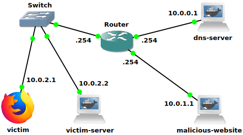

# Rebind&Conquer Lab


## Description

Rebind&Conquer Lab is a simple network environment that allows to demonstrate how the DNS Rebinding attack works and help students and aspiring professionals gain hands-on experience on how this technique can be used to bypass a firewall to attack private servers.


## Summary 

In this setup, there is a web server that simulates an IoT device which can be used to control the lights inside the user's house. Like many IoT devices, there is a web interface that allows the user to turn the lights on and off. There is also a web server that hosts the attacker's malicious website and a DNS server that contains the records for the attacker's domain name.

Every machine is configured in a Docker container and the network environment is simulated using GNS3.



### The victim's IoT device

The Docker image is available at `https://hub.docker.com/r/0xdrogon/dns-rebinding-victim`
```
docker pull 0xdrogon/dns-rebinding-victim
```

### The attacker's webserver

The Docker image is available at `https://hub.docker.com/r/0xdrogon/dns-rebinding-malware`
```
docker pull 0xdrogon/dns-rebinding-malware
```

### The DNS server

The Docker image is available at `https://hub.docker.com/r/0xdrogon/dns-rebinding-bind9`
```
docker pull 0xdrogon/dns-rebinding-bind9
```


## Setting up the lab

### 1. Clone this repository

```
$ git clone https://github.com/0xDrogon/hackergram-lab.git
```

### 2. Open the GNS3 project

```
$ gns3 gns3-project/dns-rebinding.gns3
```


## Disclaimer

This lab is extremely vulnerable and intended for educational purposes only. Do not use it in production.